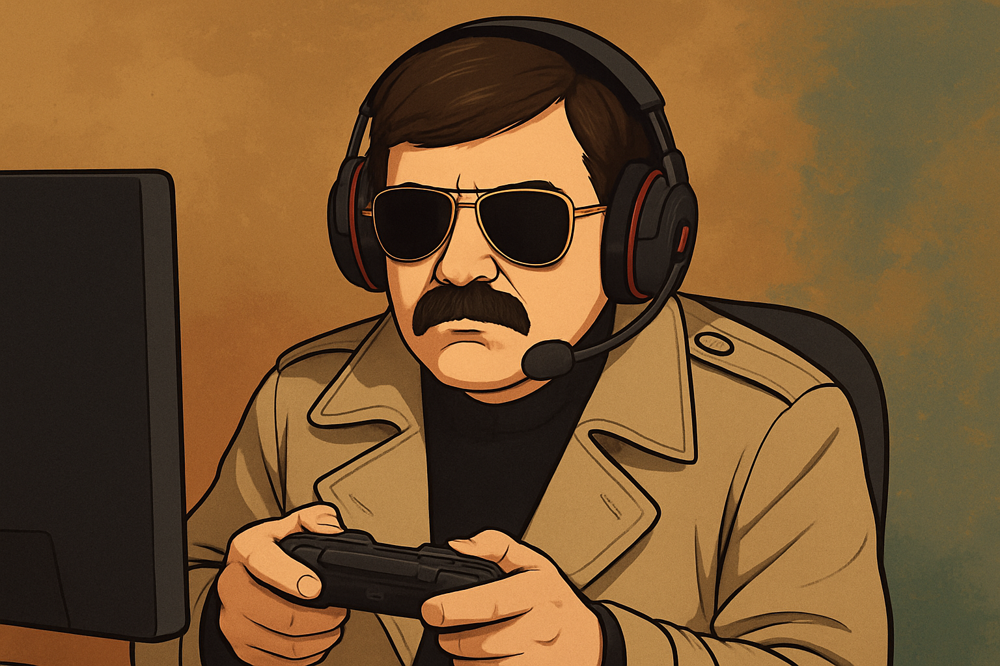

# Pala Discord Bot

A Turkish-language Discord bot with Spotify integration, AI chat capabilities, and audio playback features. The bot features "Pala" - a character-driven Turkish intelligence operative persona powered by Ollama.

## Features

### 🎵 Music Playback
- **Spotify Integration**: Search songs on Spotify and stream them to Discord voice channels
- **Playlist Support**: Play your personal Spotify playlists or public playlist URLs
- **Queue Management**: Skip tracks, view upcoming songs, and clear the queue
- **Local Audio**: Play local MP3 files from the `sound/` directory
- **Voice Controls**: Join, leave, stop, and pause commands

### 🤖 AI Chat
- Powered by Ollama (DeepSeek-R1 model)
- Turkish-language character persona (Pala - intelligence operative)
- Context-aware responses with personality

### 🎮 Commands

| Command | Description |
|---------|-------------|
| `!play <song name>` | Search Spotify and stream music to voice channel |
| `!playlist <name_or_url>` | Play a Spotify playlist (searches your playlists or accepts URL) |
| `!skip` | Skip to the next track in the playlist queue |
| `!queue` | Show currently playing track and upcoming songs |
| `!clear` | Clear the playlist queue |
| `!gel <audio_file>` | Play local audio file from sound directory |
| `!leave` | Leave the voice channel |
| `!stop` | Stop currently playing audio |
| `@pala <message>` | Chat with Pala AI character |

## Setup

### Prerequisites

- Python 3.10+
- FFmpeg (for audio processing)
- Opus library (for Discord voice)
- Ollama (for AI chat) - optional
- Discord Bot Token
- Spotify API Credentials

### Installation

1. **Clone the repository**
```bash
git clone <your-repo-url>
cd dc_bot
```

2. **Install dependencies using uv**
```bash
uv sync
```

Or with pip:
```bash
pip install -r requirements.txt
```

3. **Configure environment variables**

Copy `.env.example` to `.env` and fill in your credentials:
```bash
cp .env.example .env
```

Edit `.env`:
```env
# Discord Configuration
DISCORD_BOT_TOKEN=your_discord_bot_token_here

# Spotify API Configuration
SPOTIFY_CLIENT_ID=your_spotify_client_id
SPOTIFY_CLIENT_SECRET=your_spotify_client_secret
SPOTIFY_REDIRECT_URI=http://127.0.0.1:8888/callback

# Lavalink Configuration (optional)
LAVALINK_PASSWORD=youshallnotpass
```

4. **Configure application settings**

Copy `config.json.example` to `config.json` and adjust settings as needed:
```bash
cp config.json.example config.json
```

The default `config.json` should work for most setups, but you may need to adjust:
- `opus_library_path` - Path to your Opus library (macOS default is included)
- `local_files_directory` - Directory for local audio files

5. **Set up Ollama (optional, for AI chat)**
```bash
# Install Ollama
# Visit: https://ollama.ai

# Pull the DeepSeek-R1 model
ollama pull deepseek-r1:14b
```

### Getting API Credentials

#### Discord Bot Token
1. Go to [Discord Developer Portal](https://discord.com/developers/applications)
2. Create a new application
3. Go to the "Bot" section
4. Click "Reset Token" and copy your bot token
5. Enable required intents: Message Content, Voice States
6. Invite bot to your server with appropriate permissions

#### Spotify API Credentials
1. Go to [Spotify Developer Dashboard](https://developer.spotify.com/dashboard)
2. Create a new app
3. Copy your Client ID and Client Secret
4. Add `http://127.0.0.1:8888/callback` to Redirect URIs

## Usage

### Running the Bot

```bash
# Using uv (recommended)
uv run simple_bot.py

# Or with Python directly
python simple_bot.py
```

### Using Spotify Features

The bot uses a hybrid approach for music playback:
1. Searches Spotify for track metadata (name, artist)
2. Finds the track on YouTube
3. Streams from YouTube to Discord voice channel

This approach:
- ✅ No Spotify Premium required
- ✅ Works reliably
- ✅ Uses Spotify's excellent search
- ✅ Streams from YouTube's infrastructure

#### Playing Playlists

**From Your Personal Library:**
```
!playlist workout
!playlist chill vibes
```
The bot will search your Spotify playlists by name (fuzzy matching).

**From Public URLs:**
```
!playlist https://open.spotify.com/playlist/37i9dQZF1DXcBWIGoYBM5M
```
Works with any public Spotify playlist URL.

**Queue Management:**
```
!queue      # Show what's playing and what's next
!skip       # Skip to the next track
!clear      # Clear the entire queue
```

**How It Works:**
- Loads all tracks from the playlist
- Automatically plays through the queue sequentially
- Each track is found on YouTube and streamed
- Auto-advances when a track finishes
- Maximum 100 tracks per playlist (configurable in `config.json`)

### Testing Spotify API

You can test the Spotify integration independently:
```bash
uv run utils/spoti.py
```

This will:
- Create a virtual Spotify device
- Search for a test track
- Play it on your Spotify account

## Project Structure

```
dc_bot/
├── simple_bot.py           # Main bot file
├── pala_replik.py          # Pala character responses
├── utils/
│   ├── config.py           # Configuration loader
│   ├── spoti.py            # Spotify integration
│   ├── chat.py             # Ollama AI chat
│   ├── pick_replik.py      # Random response picker
│   └── playback_testing.py # Spotify playback tests
├── sound/                  # Local audio files directory
├── .env                    # Environment variables (not committed)
├── config.json             # Application settings (not committed)
├── .env.example            # Environment variables template
└── config.json.example     # Configuration template
```

## Configuration

### Environment Variables (`.env`)
Stores sensitive credentials:
- Discord bot token
- Spotify API credentials
- OAuth settings

### Application Settings (`config.json`)
Stores non-sensitive configuration:
- Command prefix
- Audio settings
- Ollama model configuration
- File paths

## Development

### Adding New Commands

Commands are defined in `simple_bot.py` using discord.py's command decorator:

```python
@bot.command()
async def mycommand(ctx, *, argument):
    """Command description"""
    await ctx.send("Response")
```

### Modifying Pala's Personality

Edit the system prompt in `utils/chat.py` to adjust Pala's character traits and behavior.

### Testing

Run individual components:
```bash
# Test Spotify integration
uv run utils/spoti.py

# Test playback functionality
uv run utils/playback_testing.py
```

## Troubleshooting

### Opus Library Not Found
**macOS**:
```bash
brew install opus
```

**Linux**:
```bash
sudo apt-get install libopus0
```

**Windows**:
Download opus.dll and place it in your project directory

### FFmpeg Not Found
**macOS**:
```bash
brew install ffmpeg
```

**Linux**:
```bash
sudo apt-get install ffmpeg
```

**Windows**:
Download from [ffmpeg.org](https://ffmpeg.org/download.html)

### Spotify Authentication Issues
- Make sure the redirect URI in your Spotify app matches exactly: `http://127.0.0.1:8888/callback`
- Check that your client ID and secret are correct
- Delete `.cache` and re-authenticate if needed

### Bot Not Responding
- Verify bot has "Message Content Intent" enabled in Discord Developer Portal
- Check bot has appropriate permissions in your Discord server
- Review console output for error messages

## Technologies Used

- **discord.py** - Discord API wrapper
- **spotipy** - Spotify Web API wrapper
- **yt-dlp** - YouTube video/audio downloader
- **httpx** - HTTP client for Ollama
- **Ollama** - Local AI model runtime
- **FFmpeg** - Audio processing
- **python-dotenv** - Environment variable management

## License

This project is for personal/educational use.

## Acknowledgments

- Character inspiration: Kurtlar Vadisi / Valley of the Wolves
- Pala character and Turkish dialogue
- Built with discord.py, spotipy, and yt-dlp

---

**Note**: This bot is designed for personal use in private Discord servers. Please respect Discord's Terms of Service and API rate limits.
